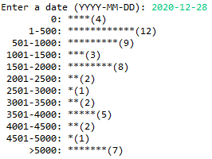

  

During the coronavirus pandemic in early 2020, the Centers for Disease Control and Prevention (CDC) was constantly releasing daily data regarding the state of all 50 U.S states and U.S territories. For an ICS 111 assignment, we were tasked with a file with this data as input, scanning it and extracting the desired numbers, and representing them in a readable, organized fashion. The files were taken directly from the CDC website and read locally from our computers. I intend to work on the code in the future so that there is some sort of live data collection, but as of right now, the project only works with downloaded files with set dates and statistics. 

Code wise, the project is somewhat simple, but it was my first time connecting something outside of code itself and displaying it in a better format. Additionally, it was and still is relevent to the current uncertain state of the pandemic. The code takes a user inputted date to draw from the data file. A scanner then finds and reads the file, storing the appropiate values from certain columns. It runs the information through a printTable function, which handles all the abbreviations, spacing, and formatting for the table. Similarly, the histogram goes through the same process, except it only accounts of daily cases at any given date for all states and territories. 

For now, the project is on pause until further notice. However, I will hopefully add more features to the code and maybe even make it part of a website with better UI. 

Source: <a href="https://github.com/waylonho/covid_data_representation"><i class="large github icon"></i>COVID Data Representation</a>

