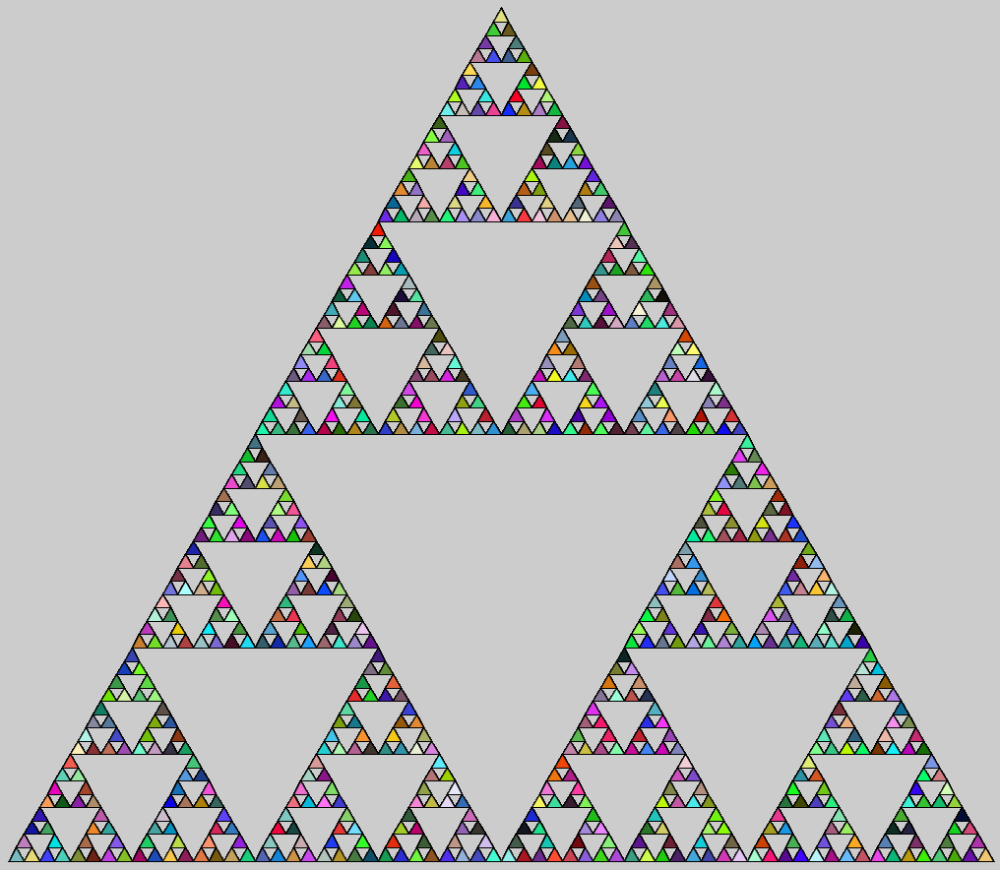

This project is a fun little math project I worked on while learning Java in ICS 211. Our task was a create some sort of fractal using [Processing](https://processing.org/), a graphical IDE. A fractal is a mathematically infinite repeating pattern that reoccurs within itself. Some popular fractals include the Mandelbrot Set, dragon curve, and the Koch snowflake. I ended up doing a deeper dive on the Sierpinski triangle, which is displayed in the image. It is three triangles creating a "triforce" shape, and within each triangle is yet another set of three triangles creating another triforce. 

Although I was originally introduced to Processing in highschool, I hadn't applied complex mathematics and geometry to something that seemed simple. Relearning the graphical functions of Processing was fun, and revisting the program after years brought fond memories. Back then, I used Processing just to learn the basics of visual programs. Now, I was trying to make something slightly more complex. Additionally, visually seeing how code works gave me more appreciation for how Java works. 

Let's talk about the code. The code itself isn't too long, but it took a while to work out the recursion part of it. The bulk of the shape drawing relied on creating a function that took mathematical inputs and made new correctly sized triangles at the right positions. Once I had trialed and errored my way through the triangle function, I had to come up with a way for the program to measure how complex I wanted the fractal. Using a level system, the user can put in what complexity level they want the resulting Sierpinski triangle to display. The majority of the geometry was found and adpoted from online sources. This included equations that could calculate the appropiate midpoint of the side of the triangle based on two points of the bottom side. The final result, added with some pretty color randomness, creates an aesthetically pleasing  Sierpinski triangle fractal.

Overall, the project deals with math that I really would like to explore more in the future. There's a lot of connection between mathematics and coding, and a topic as complex as fractals could have tons of coding applications. Figuring out how fractals work recursively and making a function out of that was certainly a learning experience. Just the math alone is very interesting, and coding a fractal really is just about understanding how the algorithm and geometry works (which Processing provides many features for). It's one of those concepts that look really cool initially, then looks cooler once you understand the layers behind it.

Source: <a href="https://github.com/waylonho/fractals"><i class="large github icon"></i>Fractals in Processing</a>
