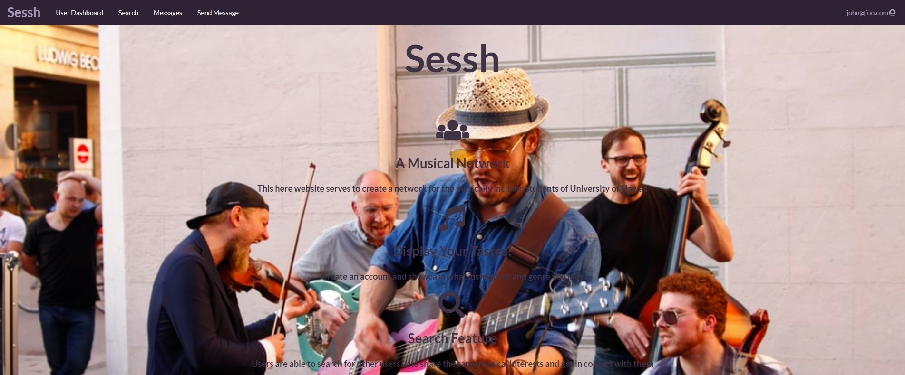

[Sessh](https://sessh.xyz/#/) is a web application for musicians to sign up, input their preferred instruments and genres, and connect with other fellow musicians to play music. The application was a group project for a software engineering class, and my group really wanted to do something that people could actually use. We wanted to try make a website that felt simple yet effective for connecting musicians. 

An image of what you will see when you visit the site is shown above. When you sign up for an account using email, the site will redirect you to a page to input your account details. This includes your name, age, instruments, and genres. Afterwards, on the navbar, there is a search menu, where you can search and filter through the other musician profiles, and messaging options, where you can message other musicians. There is an edit profile option in the top right if you want to edit your account details.

The program was coded using IntelliJ IDEA over the span of about three weeks. My group members and I met twice a week and worked on the project individually from home, communicating our changes via Discord. As a group, we discussed all the parts we'd need to make and assigned every person responsibilities. I mainly worked on the Edit Profile page and the Sign Up page. The main challenges were getting the different collections to work and update toegther. We initially needed three collections for the general musician information, instruments, and genres. Two more collections, MusiciansInstruments and MusiciansGenres, contained the musician's name along with their respective instruments or genres and were used for the search page. As I haven't had too much experience working with Meteor, it took some time to figure out how to connect the different collections. Additionally, as we started to develop the site, there were changes in the way we structured the collections. For example, the genres collection was initially just a singular text input field. However, we realized that it made more sense to use a string array to store all the different genres the musician played. Changes like this caused us to have to go back and change every schema structure that called for the genre field, expecting it to be just a string.

In the future, we would have liked to implement more features for people to plan events. Options like scheduling a music session between two people, being able to form a group, and linking to outside music sources were all discussed, and as of currently, we don't know when those will be implemented yet. On a personal level, this project was one of my first big projects working in a new coding and team environment. I learned a lot during the experience, and I hope to be involved in other social projects in the future.

Source: <a href="https://github.com/mox-amber/sessh"><i class="large github icon"></i>Sessh</a>
